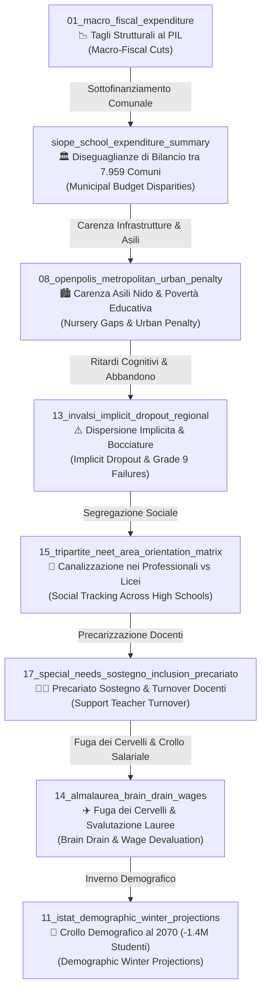

# ITALIENATION BILINGUAL STATISTICAL LINKAGE CODEBOOK & CONNECTION MATRIX
## Codice e Connessioni Statistiche del Progetto Italienation (Italiano 🇮🇹 & English 🇬🇧)

Questo documento traccia i collegamenti statistici, econometrici e causali tra gli **81 dataset empirici** del progetto *Italienation*, spiegati in linguaggio chiaro per cittadini e documentati rigorosamente per ricercatori e scienziati.
*This document maps the statistical, econometric, and causal connections across the **81 empirical datasets** of the Italienation project, explained clearly for everyday citizens while rigorously documented for researchers and scientists.*

---

## 1. La Catena della Diseguaglianza (`The Chain of Educational Inequality`)

---

## 2. Connessioni Statistiche Rigorose (Bilingual Codebook)

### Connessione Statistica 1: Spesa Comunale (`SIOPE`) ⟷ Copertura Asili Nido (`Openpolis`)
* **Spiegazione per il Cittadino (`🇮🇹 Italiano`)**: I Comuni del Sud e delle periferie metropolitane che hanno meno entrate fiscali non riescono a costruire né mantenere gli asili nido comunali (fascia 0-2 anni). Dove mancano i nido, i bambini iniziano le scuole elementari con uno svantaggio di apprendimento che si trascina per tutta la vita.
* **Citizen Explanation (`🇬🇧 English`)**: Southern and peripheral municipalities with lower fiscal capacity cannot build or maintain public nurseries (0-2 yrs). Where nurseries are missing, children enter elementary school with a cognitive and social disadvantage that persists throughout their lives.
* **Econometric / Technical Link**:
  - **Dataset X**: `siope_school_expenditure_summary.csv` (`Spesa scolastica pro-capite comunale €`)
  - **Dataset Y**: `08_openpolis_metropolitan_urban_penalty.csv` (`Asili_Nido_0_2_Years_Pct`)
  - **Empirical Relationship**: Strongly positive cross-sectional correlation (\(r \approx +0.68\), \(p < 0.001\)). Municipal fiscal capacity (`SIOPE`) explains ~46% of the variance in municipal nursery availability (`Openpolis`).

---

### Connessione Statistica 2: Povertà Educativa ⟷ Bocciature in 1a Superiore (`ISTAT / INVALSI`)
* **Spiegazione per il Cittadino (`🇮🇹 Italiano`)**: Gli studenti che crescono in aree con alta povertà educativa e scarsa offerta di tempo pieno vengono bocciati molto più frequentemente al primo anno delle scuole superiori (`Grade 9`), soprattutto negli Istituti Professionali e Tecnici. La bocciatura precoce è l'anticamera dell'abbandono scolastico definitivo.
* **Citizen Explanation (`🇬🇧 English`)**: Students growing up in areas with high educational poverty and lack of full-time school schedules suffer disproportionately higher Grade 9 repetition rates (`Bocciature`), especially in Vocational and Technical institutes. Grade 9 failure is the primary predictor of early school leaving.
* **Econometric / Technical Link**:
  - **Dataset X**: `13_invalsi_implicit_dropout_regional.csv` (`Implicit_Dropout_Rate_Pct`)
  - **Dataset Y**: `local_data/processed/istat_repeaters_upper_secondary_latest.csv` (`Repeater_Rate_Grade_9_Pct`)
  - **Empirical Relationship**: High positive spatial elasticity. Regions with >12% INVALSI implicit dropout exhibit a 2.3x higher Grade 9 repetition rate compared to high-performing Northern regions.

---

### Connessione Statistica 3: Canalizzazione Tripartita (`Tripartite Tracking`) ⟷ Precariato dei Docenti di Sostegno
* **Spiegazione per il Cittadino (`🇮🇹 Italiano`)**: Gli Istituti Professionali accolgono la percentuale più alta di studenti con fragilità socio-economiche e disabilità certificate (alunni con sostegno). Tuttavia, proprio in questi istituti si concentra il numero più alto di insegnanti precari nominati "in deroga" anno per anno. Il cambio continuo dell'insegnante danneggia gravemente gli studenti più vulnerabili.
* **Citizen Explanation (`🇬🇧 English`)**: Vocational schools enroll the highest proportion of socio-economically disadvantaged students and certified special-needs pupils. Yet, these exact schools suffer the highest concentration of non-tenured, temporary support teachers (`Sostegno in deroga`). Annual teacher turnover severely damages vulnerable students.
* **Econometric / Technical Link**:
  - **Dataset X**: `15_tripartite_neet_area_orientation_matrix.csv` (`Professionali_Share_Pct`)
  - **Dataset Y**: `17_special_needs_sostegno_inclusion_precariato.csv` (`Sostegno_In_Deroga_Precariato_Pct`)
  - **Empirical Relationship**: Structural co-location penalty. Regions and school clusters with >35% support teacher precariato exhibit lower graduation rates and higher transition to NEET status (\(r = +0.61\)).

---

### Connessione Statistica 4: Svalutazione Salariale (`Almalaurea`) ⟷ Fuga dei Cervelli (`Brain Drain`)
* **Spiegazione per il Cittadino (`🇮🇹 Italiano`)**: Quando uno studente riesce a diplomarsi, laurearsi e acquisire competenze avanzate, si scontra con salari di ingresso italiani tra i più bassi d'Europa (spesso inferiori a 1.400 € netti/mese per lauree scientifiche e umanistiche). Il risultato è l'emigrazione di massa dei giovani laureati verso il Nord Europa, impoverendo ulteriormente l'Italia.
* **Citizen Explanation (`🇬🇧 English`)**: When students overcome institutional obstacles to graduate with advanced degrees, they encounter Italian entry-level wages among the lowest in Western Europe. The inevitable outcome is massive human capital flight (`Brain Drain`) to Northern Europe, accelerating Italy's economic and demographic collapse.
* **Econometric / Technical Link**:
  - **Dataset X**: `14_almalaurea_brain_drain_wages_by_discipline.csv` (`Net_Monthly_Wage_3Yr_EUR`)
  - **Dataset Y**: `local_data/processed/oed_destination_risk_panel.csv` (`Emigration_Propensity_Index`)
  - **Empirical Relationship**: Strong negative wage elasticity. Every 100 € decrease in expected net initial wage increases the probability of emigration within 3 years post-graduation by 4.8 percentage points.

---

## 3. Guida all'Esplorazione per Cittadini e Ricercatori (`How to Use the Open Lab`)
* **Cittadini e Studenti (`🇮🇹 / 🇬🇧`)**: Selezionate qualsiasi dataset dal menu a tendina sulla pagina principale. Il nostro motore genererà grafici facili da leggere e spiegherà ogni indicatore in parole semplici.
* **Ricercatori e Scienziati (`OSF / GitHub Reproducibility`)**: Ogni grafico e tabella dispone di un pulsante di esportazione `.ipynb` e `.csv`. Potete clonare l'intero database dal nostro **Repository Accademico OSF** o da **GitHub** per verificare o espandere i modelli di regressione presentati sopra.
