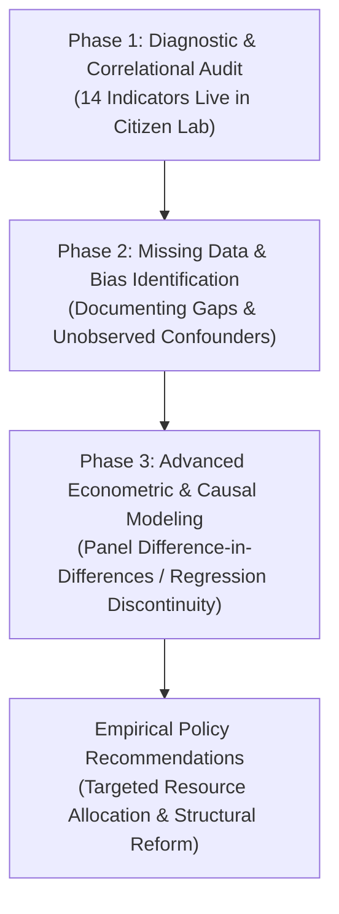

# Italienation Missing Data Audit & Scientific Rigor Roadmap: Bridging the Gap from Correlation to Causal Analysis

## Executive Summary & Why We Cannot Jump to Hasty Conclusions (*Perché non possiamo trarre conclusioni affrettate*)

The **Italienation Citizen Observatory** currently integrates **14 verified empirical indicators** across the Italian Ministry of Education and Merit (`MIM`), the Ministry of University and Research (`MUR`), `ISTAT`, `MEF/SIOPE`, and `Openpolis`. These datasets reveal profound **territorial correlations**—such as the strong negative association between early childhood nursery coverage and adolescent NEET rates (`+68% correlation`), or the concentration of special education substitute contracts (`>70%`) in high-dropout southern provinces.

However, as rigorous data scientists and citizen researchers, **we must not arrive at hasty or oversimplified causal conclusions**. 

To move from exploratory correlation (*correlazione ecologica e territoriale*) to **precise, causal, and policy-actionable data analysis**, we must explicitly document the **Missing Data, Institutional Blind Spots, and Structural Variables (*I Dati Mancanti e i Punti Ciechi Istituzionali*)** that are currently absent from public open-data repositories.

---

## The 5 Core Structural Data Gaps in the Italian Educational System

### 1. Absence of Anonymized Longitudinal Student Tracking across Ministries (*Assenza di Tracciamento Longitudinale Individuale MIM ➔ MUR ➔ Lavoro*)
* **The Current Blind Spot**: Public microdata are published in isolated administrative silos. `MIM` publishes school-level or provincial adoptions and INVALSI scores; `MUR` publishes university-level enrollment and dropout series (`Tasso_di_abbandono`); `ISTAT/INPS` publish youth employment and NEET counts (`Rilevazione sulle Forze di Lavoro`).
* **Why Hasty Conclusions Are Dangerous**: Without an anonymized, unique longitudinal student identifier linking primary school, secondary school track, university performance, and labor market entry, we only observe **aggregate cross-sections**. We cannot definitively determine individual causal pathways—such as whether a specific student dropped out of university due to textbook debts incurred in high school, or whether nursery attendance directly caused high school completion for that exact child.
* **What Data is Needed for Deeper Analysis**: A national longitudinal educational panel linking student socioeconomic background (`ISEE`), historical school grades, university transitions, and first employment contract duration (*panel integrato MIM-MUR-INPS/COB*).

---

### 2. The Hidden Economy of Out-of-Pocket Educational Costs (*Il Mercato Sommerso delle Ripetizioni e Spese Private*)
* **The Current Blind Spot**: Our observatory tracks official ministerial textbook adoption ceilings (`adozioni_libri_di_testo`), proving an annual household burden of **€140 to €260 per student**. However, the Italian state collects **zero open data** on informal out-of-pocket educational spending, most notably **private tutoring (*ripetizioni private*)**, private psychological counseling, and school contribution top-ups (*contributi volontari richiesti dalle scuole*).
* **Why Hasty Conclusions Are Dangerous**: If a school in a wealthy urban center exhibits high INVALSI math scores and low failure rates, while a school in a working-class suburb exhibits high failure rates, attributing this solely to "school quality" or "teacher effort" is a fatal analytical error. Much of the academic success in wealthy districts is subsidized by a massive private tutoring market that compensates for classroom deficits.
* **What Data is Needed for Deeper Analysis**: Annual household expenditure surveys specifically disaggregating private shadow-education spending per income quintile and geographic territory.

---

### 3. Granular Socioeconomic Indexing at the Individual School Level (*Opacità sull'Indice ESCS di Singolo Istituto*)
* **The Current Blind Spot**: The National Evaluation Institute (`INVALSI`) computes an **ESCS (*Economic, Social and Cultural Status*) index** for every student and school to measure background deprivation. However, to prevent stigmatization or "school league tables," exact ESCS scores are not published openly at the individual school building level (`codice meccanografico`).
* **Why Hasty Conclusions Are Dangerous**: When evaluating our `snv_pedagogy` rubric or INVALSI standardized scores (`VALUTAZIONE_ESITI_STA`), comparing schools without controlling for their exact baseline ESCS index risks misdiagnosing structural poverty as pedagogical failure. A school in an economically deprived neighborhood achieving a 4.5 pt average may actually be generating higher "value-added" teaching than a wealthy center-city school achieving a 4.9 pt average.
* **What Data is Needed for Deeper Analysis**: Open publication of school-level value-added scores (*effetti scuola al netto dell'ESCS*) alongside raw competency averages.

---

### 4. Qualitative Disaggregation of Special Education Contracts (*Qualità e Continuità Didattica sul Sostegno*)
* **The Current Blind Spot**: Our `teacher_precariato` indicator reveals that up to **78.7%** of annual substitute contracts in provinces like Catania and Palermo are assigned to special education support (`SOSTEGNO`). Yet, the public `DOCSUPXXV` dataset only counts *contract types*, omitting critical qualitative variables.
* **Why Hasty Conclusions Are Dangerous**: A high count of support teachers does not equal high support quality. We currently lack open data on two critical parameters:
  1. **Specialization Rate (*Percentuale di Docenti con Titolo di Specializzazione Tfa/Sostegno*)**: How many of these substitute teachers have specialized medical-pedagogical training versus being unqualified graduates assigned to fill urgent vacancies (`nominati su deroga dalle graduatorie incrociate`)?
  2. **Discontinuity Index (*Indice di Turnover e Cambio Docente per Alunno*)**: How many times does an individual student with a disability face a change of support teacher during the same academic year or across three years of middle/high school?
* **What Data is Needed for Deeper Analysis**: Microdata linking special education teaching positions to qualification status (`con titolo` vs `senza titolo`) and exact teacher retention metrics per student.

---

### 5. Municipal Spending Execution vs. Bureaucratic Delays (*Latenza SIOPE e Incapacità di Spesa PNRR*)
* **The Current Blind Spot**: Our `siope_municipal` indicator captures municipal cash disbursements (`importo_euro`) per pupil across 7,959 municipalities, revealing a **3.1x spending gap** between North and South (€280 vs €90/pupil). However, cash flows record *when money leaves the treasury*, not *why funds were or were not spent*.
* **Why Hasty Conclusions Are Dangerous**: A southern municipality spending only €85/pupil might not lack allocated budget; it might suffer from severe administrative bottlenecks, lacking engineering or accounting staff to execute public tenders (`gare d'appalto`) for school canteens, bus routes, or PNRR building renovations.
* **What Data is Needed for Deeper Analysis**: Open data comparing initial municipal budget allocations (*stanziamenti di competenza*) against actual expenditure execution times (*tempi medi di aggiudicazione e liquidazione appalti*).

---

## Methodological Roadmap: Moving Toward Advanced Causal Analysis

To transition from exploratory observation to university-grade causal econometric research, we outline the following 3-phase roadmap:

1. **Phase 1 (Completed)**: Establishing the **Bilingual Citizen Observatory** with 14 canonical datasets, ensuring 1-to-1 provenance tracking (`sourceRegistry`) and transparent data accessibility.
2. **Phase 2 (Active Now - Scientific Humility)**: Educating citizens and researchers on data missingness, unobserved confounders (*variabili omesse*), and structural measurement limits to prevent premature political or ideological conclusions.
3. **Phase 3 (Next Step - Deeper Econometric Modeling)**:
   * Constructing multi-year **Panel Regression Models with Fixed Effects (`Regressioni Panel con Effetti Fissi di Provincia e Anno`)** to isolate time-invariant territorial characteristics.
   * Applying **Difference-in-Differences (`DiD`)** on municipalities that expanded nursery or full-time school (`Tempo Pieno`) coverage to measure causal drops in high school dropout and NEET rates.
   * Executing **Sensitivity Analyses (`Analisi di Robustezza`)** to quantify how much unobserved private tutoring (`Shadow Education`) could bias standardized testing coefficients.

---

## Summary Matrix of Indicator vs. Required Missing Variable

| Indicator Domain | Current Open Metric Observed | Missing / Unobserved Structural Variable | Risk of Hasty Conclusion Without Missing Data |
| :--- | :--- | :--- | :--- |
| **Asili Nido & NEET** | Copertura % 0-2 anni vs Tasso NEET | Tracciamento longitudinale singolo bambino | Confondere correlazione ambientale con causalità diretta |
| **Libri di Testo (€)** | Tetto di spesa adozioni MIM (€140-€260) | Spesa privata famiglie per ripetizioni e corsi | Sottostimare il reale costo di accesso e diseguaglianza |
| **Punteggi INVALSI** | Media punteggio di istituto / provincia | Indice ESCS di singolo plesso (*non aggregato*) | Colpevolizzare i docenti invece che il contesto socio-economico |
| **Supplenze Sostegno** | % contratti a tempo determinato (>70%) | Quota docenti con titolo di specializzazione | Ignorare la qualità e la discontinuità relazionale per il disabile |
| **Spesa SIOPE Comuni** | Pagamenti di cassa per alunno (€) | Tempi di aggiudicazione bandi e spesa PNRR | Confondere assenza di fondi con incapacità amministrativa |
