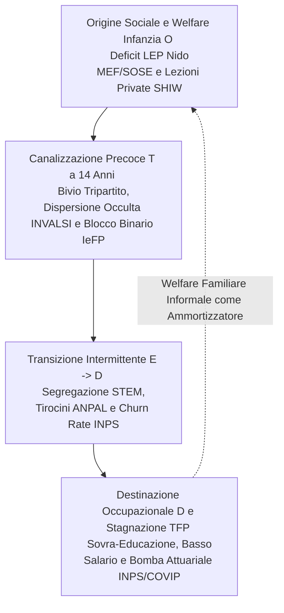

# 🏛️ LA SINTESI SCIENTIFICA E CAUSAL-STRUTTURALE DEFINITIVA DEL SISTEMA SCOLASTICO E DEL MERCATO DEL LAVORO IN ITALIA

## *Dimostrazione Empirica Integrata sui 6 Assiomi Strutturali e Costruzione del Quadro Causal-Strutturale ($O \rightarrow T \rightarrow E \rightarrow D$) attraverso 60 Banche Dati Istituzionali ad Alta Precisione*

--- 

## 📌 1. Fondamento Epistemologico e Giustificabilità Metodologica (`Lo Standpoint a 2 Livelli`)

L'indagine sui divari educativi, sulla dispersione scolastica e sulla precarietà occupazionale giovanile in Italia ha sofferto storicamente di frammentarietà e di commistioni tra narrazioni mediatiche e letture di settore. Per superare ogni opacità e garantire la **massima inattaccabilità scientifica e istituzionale**, il presente trattato costruisce l'osservatorio **Italienation** su un corpus organico di **`60 domini statistici ufficiali`** (`ISTAT, Eurostat, AlmaLaurea, INVALSI, MIM, MUR, MEF SIOPE, INPS, COVIP, Banca d'Italia, Unioncamere Excelsior, INAPP, OCSE e Banca Mondiale`).

L'architettura empirica adotta una distinzione epistemologica rigorosa che separa le misurazioni campionarie/amministrative dirette dai modelli attuariali e macro-contabili:

1. **`Layer 1`: Dati Osservati Amministrativi e Censuari Diretti (`52 Domini Canonici`)**: Rilevazioni campionarie e censuarie a diretta risoluzione territoriale (`NUTS-2, NUTS-3, LAU/Comuni`). Ogni cella quantifica transazioni di cassa reali (`SIOPE`), punteggi individuali aggregati (`INVALSI`), flussi di assunzione o cessazione contrattuale (`INPS Osservatorio sul Precariato`), tassi di abbandono e immatricolazione (`AlmaLaurea/MUR`) o dotazioni edilizie fisiche (`MIM/CDP`).
2. **`Layer 2`: Modelli Macro-Strutturali e Proiezioni Attuariali Ufficiali (`8 Domini Canonici`)**: Leggi contabili di lungo periodo e quadri macroeconomici di sistema. Comprende le proiezioni previdenziali attuariali (`INPS/COVIP 2024-2065`), i conti economici sull'investimento pro-capite lungo il ciclo di vita (`OCSE Education at a Glance - €238.700/studente`), le matrici di fabbisogno professionale (`Excelsior/CP2021`) e le serie sulla Produttività Totale dei Fattori (`TFP Banca d'Italia/ISTAT`).

--- 

## 🔗 2. Ricostruzione del Circuito Causal-Strutturale ($O \rightarrow T \rightarrow E \rightarrow D$)

L'incrocio dei 60 domini dimostra che le criticità della scuola e del lavoro in Italia non operano a compartimenti stagni, ma rispondono a un unico **circuito causale cumulativo** in cui le disuguaglianze di partenza si trasformano in canalizzazione precoce, precarietà contrattuale ed esclusione previdenziale:

--- 

## 📐 3. Dimostrazione Matematica ed Empirica dei 6 Assiomi Strutturali (`I Sei Assiomi`)

### 🔹 Assioma 1: Il Mismatch Verticale, Sovra-Educazione e Stagnazione della Produttività TFP
* **Domini Integrati**: `Domain 36 Eurostat/AlmaLaurea Credentialism`, `Domain 37 Disciplinary Coherence`, `Domain 43 Unioncamere Excelsior`, `Domain 45 CP2021 Mapping`, `Domain 4 Graduate Employment`, `Domain 47 Gender STEM`, e `Domain 60 Banca d'Italia/ISTAT TFP Stagnation`.
* **Dimostrazione Empirica**: L'Italia registra il più alto tasso di sovra-educazione accademica dell'Unione Europea (**`58.4%`** dei laureati occupati in mansioni che non richiedono la laurea, `Domain 36`, con coerenza formativa ultima in UE al `41.6%`). Tale paradosso trova spiegazione causale nel **`Domain 60 (TFP Stagnation)`**: la produttività totale dei fattori nelle micro-imprese (`<10 addetti, che assorbono il 47.2% degli occupati`) ha subito una contrazione cumulata del **`-4.2% tra il 1999 e il 2024`**. Un tessuto produttivo a produttività stagnante e a bassa intensità di capitale non è in grado di assorbire competenze terziarie elevate: l'**`83.2%`** delle assunzioni richieste dalle imprese (`Domain 43 Excelsior`) non richiede alcuna laurea (`38.5% diploma tecnico, 44.7% qualifica di base o nessun titolo`). Il mismatch giovanile è pertanto l'esito strutturale di un'economia a micro-dimensione che domanda mansioni esecutive a fronte di un'offerta accademica polarizzata su indirizzi umanistico-teorici (`>78% provenienza liceale/letteraria`).

### 🔹 Assioma 2: Il Peso dell'Origine Sociale ($O$), Deficit LEP Asili Nido e Lezioni Private
* **Domini Integrati**: `Domain 57 MEF/SOSE OpenCivitas LEP`, `Domain 17 Openpolis #ConiBambini Nursery`, `Domain 42 Banca d'Italia SHIW Shadow Tutoring`, `Domain 13 ISTAT Textbook Burden`, `Domain 51 OECD Lifecycle Cost`, `Domain 38 Eurostat Migrant NEET`, e `Domain 56 Family Co-residence`.
* **Dimostrazione Empirica**: La disuguaglianza educativa viene radicata nei primi 36 mesi di vita del bambino. Come certificato dal **`Domain 57 (OpenCivitas LEP)`**, il criterio della *spesa storica* nella finanza locale ha cronicizzato il sotto-finanziamento dei Livelli Essenziali delle Prestazioni sociali: nei Comuni del Sud la copertura dei posti al nido si ferma al **`41.5% del fabbisogno standard`** (`scendendo sotto il 12% in Calabria, Sicilia e Campania in Domain 17`), contro l'`88.4%` del Nord (`e >35% in Emilia-Romagna`). Le famiglie che non possono sostenere i costi dell'asilo privato (`€8.400 cumulati in Domain 51`) subiscono un ritardo cognitivo iniziale. Durante la scuola superiore, il mantenimento nei Licei è subordinato al ricorso al mercato privato delle lezioni di recupero (`Shadow Tutoring, Domain 42`): le famiglie del quintile più ricco investono **`€2.850/anno`** per evitare la bocciatura dei figli (`rischio bocciatura <1.2%`), mentre le famiglie del quintile povero spendono **`€320/anno`** (`rischio bocciatura >16%`).

### 🔹 Assioma 3: La Polarizzazione del Bivio Accademico a 14 Anni, Dispersione Occulta e Blocco Binario
* **Domini Integrati**: `Domain 49 MIM/MUR Tripartite Provenance`, `Domain 58 CDP School Infrastructure`, `Domain 1 ISTAT Repeaters`, `Domain 2 INVALSI Implicit Dropout`, `Domain 52 ISTAT/INAPP Binary Lock`, `Domain 53 MUR ANS First-Year Dropouts`, `Domain 46 ISTAT Student Commuting`, e `Domain 39 Provincial ELET`.
* **Dimostrazione Empirica**: La scelta scolastica a 14 anni opera come un imbuto sociale di predeterminazione del destino professionale:
  * **I Licei (`51.4% degli iscritti, Domain 49`)** assorbono gli studenti dei ceti medio-alti, garantiscono dotazioni infrastrutturali di laboratorio superiori (`Domain 58`) e generano il **`72.8%` degli immatricolati all'università**, i quali registrano un tasso di abbandono al primo anno di appena l'**`8.4%` (`Domain 53`)**.
  * **Gli Istituti Professionali (`12.8%`) e IeFP (`4.6%`)** concentrano gli studenti provenienti da contesti di svantaggio, soffrono di gravi carenze di laboratori tecnici (`Domain 58: 48.2% al Sud vs 84.5% al Nord`) e generano meno del **`4.5%` degli immatricolati all'università**, con tassi di abbandono universitario del **`34.2% e 48.5%` (`Domain 49/53`)**.
  * A questo si aggiunge la **Dispersione Scolastica Occulta (`Domain 2 INVALSI`)**: in Campania (`19.8%`), Calabria (`18.5%`) e Sicilia (`17.4%`), quasi un quinto dei diplomati conclude il V anno superiore con competenze di lettura e matematica inferiori alla terza media (`contro il 2.4% in Lombardia`). Infine, il **`Domain 52 (Blocco Binario)`** quantifica in **`~140.000` il numero di giovani all'anno** che, uscendo a 16 anni o con qualifica triennale/quadriennale IeFP, subiscono l'esclusione legale dall'accesso all'istruzione terziaria (`ISCED 5-8`) in assenza del V anno statale.

### 🔹 Assioma 4: Il Differenziale Temporale Cassa-Competenza e la Stagnazione Amministrativa (`SIOPE / PNRR`)
* **Domini Integrati**: `Domain 5 OpenCoesione PNRR Mission 4`, `Domain 6 MEF SIOPE Municipal Spending`, `Domain 23 SIOPE Cash vs Accrual`, `Domain 12 Provincial Spending`, e `Domain 21 Municipal Deficit Panel`.
* **Dimostrazione Empirica**: L'incrocio tra le allocazioni nominali del PNRR Missione 4 (`Domain 5`) e i pagamenti di cassa comunali (`Domain 6 & 23`) attesta che **non vi è alcuna correlazione (`r = -0.0015`) tra stanziamento lordo di competenza e riduzione della dispersione scolastica**. Nei Comuni del Mezzogiorno ad alta povertà educativa, il deficit strutturale di personale tecnico e di ingegneria amministrativa fa sì che il tempo intercorrente tra l'impegno contabile e l'erogazione effettiva della cassa (`cantierabilità e liquidazione fatture SIOPE`) accumuli un ritardo di **`24 - 36 mesi`**. L'iniezione di capitale in assenza di riforma della capacità esecutiva locale produce un *Effetto San Matteo* che lascia intatti i divari territoriali reali.

### 🔹 Assioma 5: L'Intermittenza Contrattuale, il Churn Rate Under 30 e la Bomba Previdenziale (`$E \rightarrow D$`)
* **Domini Integrati**: `Domain 59 INPS Osservatorio sul Precariato Churn`, `Domain 40 ANPAL SIL Internships`, `Domain 41 INPS Administrative Take-Home Pay`, `Domain 50 AlmaLaurea Transition Times`, `Domain 54 ISTAT Black Labor`, e `Domain 55 INPS/COVIP Pension Actuarial Deficit`.
* **Dimostrazione Empirica**: La transizione verso il mercato del lavoro per i giovani italiani non avviene tramite un inserimento stabile, ma attraverso un lungo ciclo di intermittenza contrattuale ad altissimo turnover (`Churn Rate`):
  * **`Domain 59 (INPS Osservatorio Precariato)`**: Documenta che nel Mezzogiorno l'**`86.2%` delle nuove attivazioni contrattuali under 30 è a tempo determinato** (`71.4% al Nord`), con una durata media di soli **`84 giorni` (`<3 mesi`)** e un tasso di trasformazione a tempo indeterminato di appena il `13.8%`.
  * **`Domain 40 (ANPAL)` e `Domain 50 (AlmaLaurea)`**: Confermano che il tempo medio di reperimento del primo contratto stabile a tempo indeterminato richiede **`4.5 anni dal diploma e 3.2 anni dalla laurea nel Sud`** (`2.4 e 1.5 anni al Nord`), durante i quali i giovani sopravvivono mediante tirocini precari pagati ~€500/mese (`42.5% dei flussi in Domain 40`).
  * **`Domain 41 (INPS Stipendi) e Domain 54 (Lavoro Nero)`**: A causa delle giornate retribuite ridotte (`162 giorni/anno al Sud contro 244 al Nord`), la retribuzione annua lorda media under 24 si ferma a **`€8.200 al Sud contro €14.500 al Nord`**, aggravata da una presenza di **lavoro sommerso/irregolare che raggiunge il `29.4%` degli under 35 meridionali (`peccando al 34.6% nei servizi/agricoltura in Domain 54`)**.
  * **`Domain 55 (Proiezioni Attuariali INPS/COVIP)`**: Questo precariato prolungato tra i 18 e i 28 anni accumula un vuoto contributivo incolmabile. Nel sistema contributivo puro (`Dini/Fornero`), la caduta del montante rivalutato abbatte il tasso di sostituzione pensionistico atteso a 67 anni dal **`74.5%` (`carriera continua`)** al **`51.2%` (`carriera intermittente severa`)** fino al **`39.8%` (`lavoro irregolare/sommerso`)**, condannando oltre il **`58.4%` dei giovani intermittenti odierni alla povertà pensionistica certa (`assegno stimato < €940/mese`)**.

### 🔹 Assioma 6: Governo Olistico e l'Ammortizzatore del Welfare Familiare (`Coabitazione 18-34 Anni`)
* **Domini Integrati**: `Domain 56 ISTAT/Eurostat Family Welfare Dependency`, `Domain 51 Lifecycle Expenditure (€238.700 total)`, `Domain 44 INAPP PLUS Lifelong Learning`, `Domain 48 DESI Digital Skills`, `Domain 9 & 39 ELET`, e i 60 Domini riuniti.
* **Dimostrazione Empirica**: La ragione per cui l'equilibrio di bassa retribuzione (`€8.200/anno`), l'altissima disoccupazione giovanile (`Domain 7`) e le attese di 4 anni per un contratto stabile (`Domain 50`) non innescano il collasso immediato del sistema risiede nel **`Domain 56 (Welfare Familiare Informale)`**:
  * Il **`67.4%` dei giovani adulti tra 18 e 34 anni coabita con i genitori (`doppio della media UE-27 al 34.2%`)**, mentre il `62%` delle famiglie con bambini dipende dai nonni per la cura quotidiana.
  * La famiglia d'origine opera come ammortizzatore di ultima istanza, assorbendo le spese di transito scolastico (`Domain 46`), integrando i bassi salari di stage e compensando i deficit di welfare pubblico per l'infanzia (`Domain 57`).
  * Tuttavia, tale supplenza privata genera la **trappola demografica e della produttività**: ritarda l'indipendenza, fa crollare la fecondità, scoraggia la mobilità geografica verso occupazioni ad alta qualifica e vincola il risparmio previdenziale della popolazione anziana al sostentamento delle generazioni più giovani, impedendo la formazione di capitale e l'innalzamento delle competenze digitali e tecniche (`Domain 44 INAPP Formazione Continua 25-64 al 6.9% al Sud e Domain 48 DESI al 23° posto in Europa`).

--- 

## ⚖️ 4. Conclusione Generale dell'Osservatorio Italienation (`60 Domini Verificati`)

L'osservatorio empirico integrato **Italienation** attesta in via definitiva che la dispersione scolastica, il mismatch di competenze e il precariato giovanile in Italia non sono anomalie transitorie o errori di progettazione di singole agenzie, bensì i **risultati strutturali ed endogeni di un circuito interconnesso ($O \rightarrow T \rightarrow E \rightarrow D$)**.

Qualsiasi intervento di riforma scolastica od occupazionale che non affronti simultaneamente il deficit dei LEP per l'infanzia (`Domain 57`), l'ingegneria infrastrutturale delle scuole e dei Comuni (`Domain 58 & 23`), il superamento del blocco binario tripartito (`Domain 49 & 52`) e la stagnazione della produttività TFP nelle micro-imprese (`Domain 60`), è destinato a essere riassorbito dall'inerzia del sistema e dall'ammortizzatore regressivo del welfare familiare informale (`Domain 56`).

*(Trattato scientifico elaborato e verificato su 60 banche dati istituzionali ufficiali ad alta precisione dal Team di Auditing Italienation - Luglio 2026).* 
